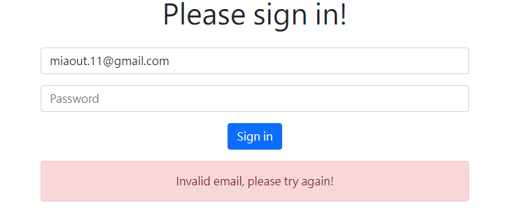

# User Authentication - introduction

這是一個頁面，讓特定使用者可以透過Email跟密碼登入

首頁圖

成功登入

E-mail錯誤

密碼錯誤


### 安裝與執行步驟

1. 請先確認有安裝 node.js 與 npm
2. 將專案 clone 到本地
3. 環境變數設置: 
   * Windows cmd： set "MONGODB_USERAUTH_URI=你的MongoDB連線字串"
   * MacOS terminal and git bash :  export MONGODB_USERAUTH_URI="你的MongoDB連線字串"
4. 在本地開啟之後，透過終端機進入資料夾，輸入：

   ```
   npm install  //安裝套件
   ```

5. 安裝完畢後，繼續輸入：

   ```
   npm run start  //執行程式
   ```

6. 若看見此行訊息則代表順利運行，打開瀏覽器進入到以下網址

   ```
   Listening on http://localhost:3000
   ```

7. 結束使用

   ```
   ctrl + c  //結束程式
   ```

### 開發工具

- [Visual Studio Code](https://visualstudio.microsoft.com/zh-hant/) 
- [Node.js](https://nodejs.org/en/)
- [Express 4.18.2](https://www.npmjs.com/package/express) -
- [Express-Handlebars 4.0.2](https://www.npmjs.com/package/express-handlebars)
- [Express-session 1.17.3](https://www.npmjs.com/package/express-session)
- [bootstrap 5.1.3](https://getbootstrap.com/docs/5.1/getting-started/introduction/)
- [MongoDB 3.5.7](https://www.mongodb.com/try/download/community2)
- [Mongoose 5.9.16](https://www.npmjs.com/package/mongoose)
